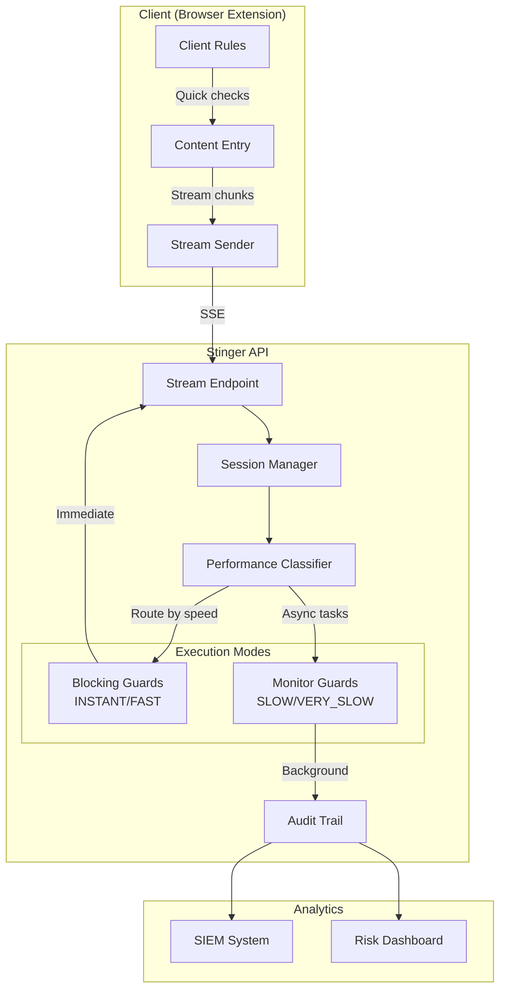
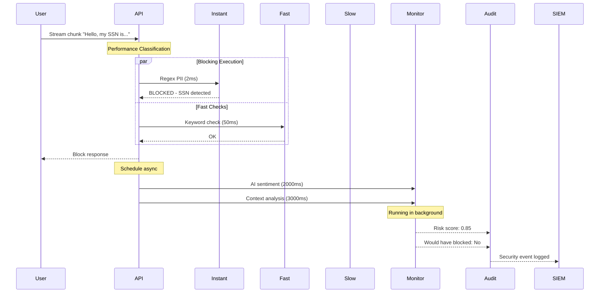
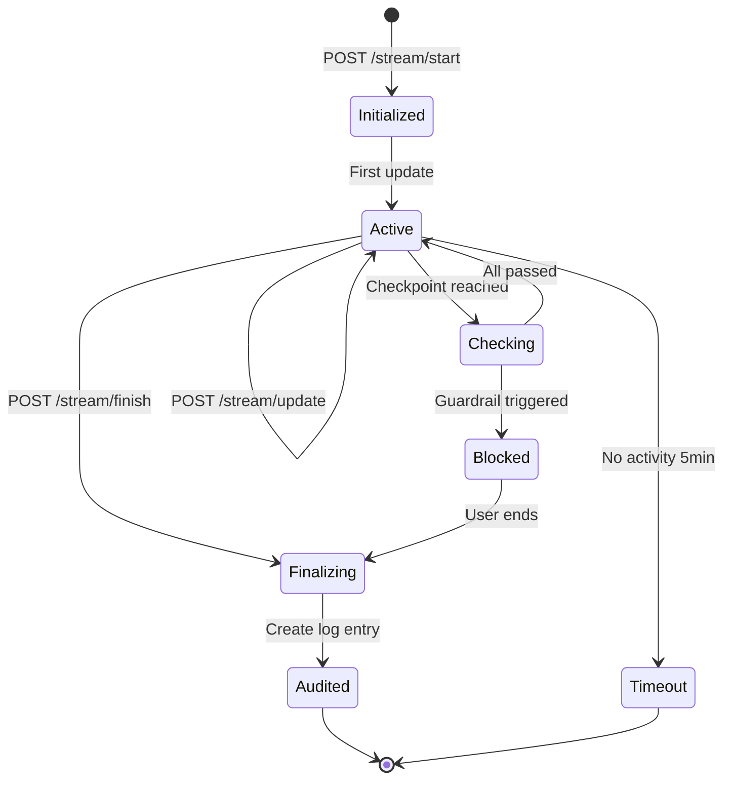
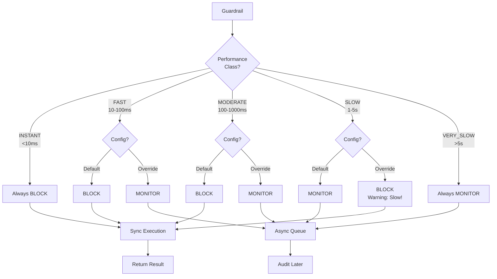

# Phase 14 Streaming Flow Diagrams

## Overall Streaming Architecture



## Guardrail Execution Flow by Performance Class



## Streaming Session Lifecycle



## Performance-Based Checkpoint Strategy

```
Content Stream: "Write a Python function to analyze customer data and..."

INSTANT (<10ms):   |W|r|i|t|e| |a| |P|y|t|h|o|n|...
                    ✓ ✓ ✓ ✓ ✓ ✓ ✓ ✓ ✓ ✓ ✓ ✓ ✓ ✓

FAST (10-100ms):    |Write| |a| |Python| |function|...
                     ✓      ✓   ✓        ✓

MODERATE (100-1000ms): |Write a Python function|...
                        ✓

SLOW (1-5s):        |Write a Python function to analyze customer data|.
                     ✓ (or async)

VERY_SLOW (>5s):    [Entire message - async only]
                     ➜ Monitor mode
```

## Monitor Mode Decision Flow



## Implementation Priority Matrix

```
High Impact / Low Effort:
┌─────────────────────────────┐
│ • Client-side regex rules   │
│ • Performance metadata      │
│ • Basic monitor mode        │
└─────────────────────────────┘
            ↓
High Impact / High Effort:
┌─────────────────────────────┐
│ • Streaming API endpoints   │
│ • Session management        │
│ • Web demo streaming        │
└─────────────────────────────┘
            ↓
Low Impact / Low Effort:
┌─────────────────────────────┐
│ • Status indicators         │
│ • Metrics enhancement       │
│ • Documentation             │
└─────────────────────────────┘
```